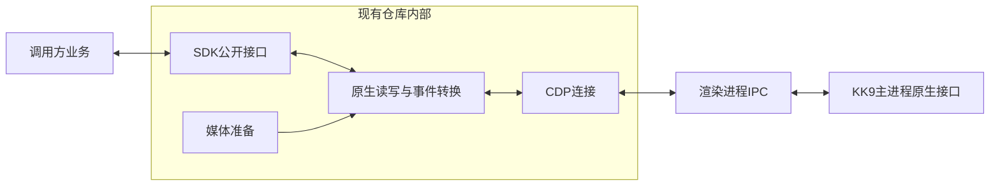
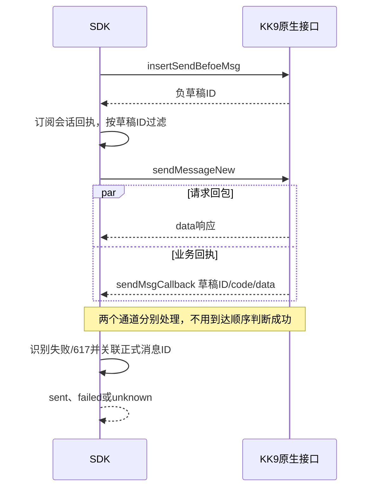

# 原生 SDK 改造方案

状态：T01、T02、C1已通过PR #1归档；T03已随PR #2合并，T04实现已随PR #3合并，记录见 [archive/T03-T04.md](archive/T03-T04.md)。T04按用户要求停止补测，未验证项保留，其他设备本人测试已取消。T05已完成双目标三类撤回验收并随PR #4合并，代码基线dd898ad7693944780d5900af3f9eee654b99646f，记录见 [archive/T05.md](archive/T05.md)。当前仅派发 [T06](T06-handoff.md)，不补测前序任务，不实施C2及其他后续任务。

## 目标与非目标

让 `@kairo/driver` 通过 KK9 原生接口完成身份、会话、消息、撤回和组织查询，不从聊天窗口取数据，不模拟点击、输入或发送按钮，不隐式回退 DOM。

继续依赖已登录 KK9、CDP、渲染进程的 Node/Electron 能力及客户端内部接口。去掉 DOM 自动化不等于脱离 KK9，也不等于不在渲染进程执行代码。

不新增 Agent、Memory、数据库、业务编排、重连监督器、插件框架或第二套客户端。保持现有 `src/cdp`、`src/bridge`、`src/types` 结构。无需外部兼容，不提供旧 API 别名、迁移或双版本配置。

每个能力在现有实现中直接切换，更新该能力的所有调用、Fake、测试与说明后验收。不先把整个仓库改成不能运行的框架，也不一次删除 `src/dom`。未切换的能力暂不改，不为过渡新增兼容层。

任务在 [todo.md](todo.md) 跟踪。

## 已有证据与缺项

- 真机：无参 `getMemberDetail()` 取得当前登录身份；`getConversations` 与目标档案确定授权私聊；指定 native sessionID 直接读取历史，已读索引不变。
- 静态：普通入站与远端撤回走原生 `message`；本机 own 撤回有另一条原生动作和本地通知；普通发送结果走会话 `sendMsgCallback`。
- T03已修正原版普通失败、上传失败及617正ID误判；公共结果为sent/failed/unknown。双目标文本和提交后断线已真机验收，真实617和服务器失败没有主动制造。
- T04当前已真机核对双目标SDK本次业务回执、正式ID/索引、outbound回显一次、历史不重放、防重与组件重建。用户协助后的私聊137490447/索引685及群137491549/索引121均为sender3585的真实新入站，SDK与原生message身份一致且各一次，目标未显示及实际组件重建后接收已通过。本机人工私聊137497189/索引686、群137496459/索引122均为sender5761/device33039、原生sendMsgCallback、outbound一次且无SDK发送键，已清理并独立确认C1。其他设备本人消息测试已取消；实际组件缺席及真实状态更新尚未全部验收。普通系统分流、两种回显竞态及提交期间组件清空监听由协议支撑的生成脚本回归覆盖，不冒充真机结论。
- 最终收尾：用户认为无需继续多轮补测，停止追加操作。真实无组件群入站137507627/索引127通过；无组件私聊137507597/索引689携带群标记，但SDK按真实私聊收到一次，保留事实与脚本专项false，不把标签匹配失败当SDK失败。六条协助轮本人测试文本全部撤回，jshookmcp独立核对C:op:/C1；自有采集、Driver Hook及发送观察器均退出，pendingSends=0，原客户端监听保留。全部未验证项见todo，不再安排用户补发。
- 档案getter不返回deviceID；T03已核对草稿设备列允许NULL，正式发送核心使用CORE_DATA注册设备。本轮正式记录设备33039，不读Vue或旧消息冒充当前设备getter。
- 前序取证材料在原主工作区仅读，不能当作T04结果。本轮元数据见 `tmp/t04-protocol-evidence.json`、`tmp/t04-live-evidence.json` 及按运行ID保留的专项结果。

## 契约决策

### 身份和目标

- 会话的公开 `id` 使用原生会话 ID 的字符串形式；目标私聊是 `716791`。
- 用户 UID 单独保留；目标用户是 `3585`。`0-3585` 是客户端界面标识，不再与原生会话 ID 混用。界面事件名需要时在内部生成，不作为公开会话主键。
- 原生会话类型与接收对象单独保存，私聊、群、讨论组和服务号不能随意折叠成同一种类型。先支持现有真实能力，未验收的类型明确记录，不能假装私聊通过即全部通过。
- 发消息、读历史、撤回、标记已读必须指定会话；不按名称模糊匹配，不默认当前激活窗口，不把纯数字会话 ID 当用户 UID。
- 私聊对端以原生字段和当前账号解析；覆盖 `typeID` 指向自己的创建方向，不盲目使用 `typeID || sesTypeID`。
- 移除窗口语义的 `active`、`getCurrentSession`、`selectSession`、选择器配置和发送前界面检查。每项与其调用方在对应切片同时切换。

### 发送结果

T03已采用 `sent | failed | unknown`，删除缺少投递证据的 `delivered` 与旧 `success` 判别：

- `sent`：本次负草稿已收到原生业务成功回执、排除617等业务失败，关联到正式消息 ID；不代表对方已收到或已读。
- `failed`：本地预检或原生业务回执明确失败，保留错误码与上下文。
- `unknown`：已触发或可能触发发送，但在限定等待内不能取得可靠结果，例如提交后断线。不得自动重发。

结果以必填 `status` 区分，不再让可选 `status` 和 `success` 两个字段互相矛盾。`sent` 分支必须有 `messageId`；失败带错误；每个发送结果有稳定 `operationId`。发送前的无效输入和消息业务失败按边界区分；查询接口失败抛已有 `DriverError`，不把异常吞成空列表。

保留现有发送意图登记和去重能力，复用 `send-operation.ts`。同一操作 ID 不能代表不同内容。SDK不额外引入数据库，不声称本地去重等于服务端幂等或跨进程恰好一次。调用方已有持久化接入按新的结果契约更新。

原生回执到来后若正式 ID 尚未确定，可继续关联正式记录；不能凭外层code0或任意正ID转成sent。617即使回调code0或数据库status为success也必须识别为业务失败。

### 消息与事件

- 方向按消息发送者与当前账号比较，不按“员工还是机器人”判断。
- T04已移除 `operator/bot_echo` 及 `recordBotSentMessageId/isBotSentMessageId`，没有兼容别名。真实身份和方向保留；本次已确认实时回显带 `sdkSendKey`，与既有 `createNativeMessageKey` 对照意图，历史不伪造SDK确认。
- 新实时聊天、session-only已读更新、系统事件、历史记录、自身发送回显分开处理。查历史不能重新派发“新入站”。
- 撤回事件的目标取正文 `content.msgID`，不把系统事件自身ID作为被撤回消息ID。历史中的撤回状态不等于刚发生的新撤回事件。
- 本机SDK撤回由明确的原生操作结果形成对应通知；若同时收到服务器事件，按会话与被撤回消息ID去重。人手在KK9界面发起的本机撤回可能只经过本地通知，必须验证独立捕获路线；不能未经验证删除Vue监听，也不为保留它继续读取聊天DOM。
- SDK不承诺通过额外操作界面实现即时刷新。发送是否正确、事件是否正确和窗口是否立即显示是不同验收项；若原生路线不能即时显示，记录真实差异，不偷偷恢复DOM补偿。

### 媒体、历史与生命周期

- 图片缩略图、AMR编码、协议内容序列化是媒体准备，不是聊天DOM自动化；纯数据工具迁出 `src/dom` 后复用，不因目录名删除它们。
- 富文本以已确认的原生节点与消息级font为依据。HTML、逐段样式、删除线、高亮等若没有协议依据，收窄接口并更新调用与测试，不保留空实现或兼容转换。
- 主动历史范围读取保留。自动切换未读窗口的轮询删除；需要定时扫描或恢复缺失消息的调用方决定何时调用，不由SDK监督业务恢复。
- 保留现有CDP连接、连接失效通知、旧连接不污染新实例的隔离和真实消息去重。本轮不顺带重做连接生命周期或添加新的安全框架。

## 实施任务

每项是可运行的能力切换，不是占位框架。列出的文件是核心修改范围；对应 Fake、公开导出、调用方和说明在同一能力切换时同步更新。开始实际修改导出前重新查询 LSP references；当前查询的源代码引用不能替代测试与示例检查。

### T01：原生身份与会话读取

依赖：无。

核心文件：`src/driver.ts`、`src/bridge/session-ops.ts`、`src/types/index.ts`、`tests/bridge-session-ops.test.ts`、`tests/driver.test.ts`。

验收：
1. 身份和会话查询不调用 `document.querySelector` 或读取 `__vue__`；空会话与查询失败有不同结果。
2. 会话ID、原生类型、接收对象和用户UID含义明确，覆盖私聊两种创建方向；Fake与消费这些字段的代码同步更新。
3. 不切换窗口即可读到已授权账号和目标映射；记录预插入设备字段的实际要求与原生来源，不使用假默认值。

验证：相关行为测试、`pnpm check`；经jshookmcp连接的只读身份和会话场景。未经授权不创建新会话。

### T02：明确目标的历史读取

依赖：T01。

核心文件：`src/bridge/message-ops.ts`、`src/driver.ts`、`src/types/index.ts`、`tests/bridge-message-ops.test.ts`、`tests/message-ops.test.ts`。

验收：
1. 显式会话ID直接传给原生getMessages；不需要激活聊天或读取sortedSessions。
2. 返回结果正确关联会话与消息ID；历史不派发实时事件，缺页、空页、原生失败按事实区分。
3. 真机读取前后已读索引不变；移除这条读取路径的DOM回退。

验证：历史行为测试、`pnpm check`；授权私聊历史查询。对应真实脚本移除窗口切换依赖，保留身份核对。

### T03：最小原生文本发送与结果确认

依赖：T01，正式记录核对使用T02。

核心文件：`src/bridge/renderer-script.ts`、`src/bridge/send-status.ts`、`src/bridge/message-ops.ts`、`src/send-operation.ts`、`src/types/index.ts`；发送状态调用、Fake与回归按同一契约切换。

验收：
1. 负草稿ID取得后、sendMessageNew之前订阅会话回执；过滤不属于本次草稿的回调。完成或退出后只移除SDK自身监听，不破坏KK9监听。
2. 成功、上传失败、原生业务失败、617、提交后断线分别得到正确结果；外层code0和正ID都不能单独判成功。原版受控反例成为行为回归。
3. 向明确目标发文本，无编辑器、按钮、当前窗口依赖；操作ID重复不二次发送，查询状态不触发发送。

验证：`tests/send-operation.test.ts`、`tests/bridge-message-ops.test.ts`相关用例及`pnpm check`；保留门禁的授权私聊文本脚本。未确认必要原生草稿字段前不触发真实发送，不随意写入msgFlag而忽略协议含义。

### T04：实时消息与自身回显

依赖：T01、T03。

核心文件：`src/bridge/event-bridge.ts`、`src/bridge/converter.ts`、`src/driver.ts`、`src/types/index.ts`、`tests/event-bridge.test.ts`；规范化和来源测试同步更新。

验收：
1. 原生message包按聊天、系统消息、会话状态分流；方向按当前账号判断。
2. 新实时入站与SDK确认的自身回显各派发一次，查历史不制造新消息；保留会话范围的去重。
3. KK9显示别的会话、聊天组件不存在或重建时仍能接收；移除已被原生路线完整覆盖的Vue转发。

验证：事件、规范化、生命周期测试及`pnpm check`；由int2024发新测试消息，核对native消息身份和自身回显。本机人工发送单独记录，不能靠本地替身代替真机。其他设备本人消息测试已按用户要求取消，不列本轮验收条件，不再要求提供设备。

当前实施：全局原生message接收与本机业务回调观察独立于普通聊天Vue转发；只登记/释放本SDK在途回执函数，不恢复KK9或其他采集监听。状态包无聊天事件，普通系统记录保留。聊天组件方法Hook和观察器仅保留尚属T05的人工撤回路线。无组件/无总线与监听清空由执行生成脚本回归证明；首轮真机实际组件UID6150→6193→6234，双目标回显已通过，不能据此宣称真实缺席或员工入站已通过。详细状态见 [todo.md](todo.md) 与启动说明。

### T05：本机、远端撤回

依赖：T02、T04。

核心文件：`src/bridge/recall-ops.ts`、`src/bridge/event-bridge.ts`、`src/bridge/converter.ts`、`src/types/index.ts`、`tests/recall.test.ts`。

验收：
1. 显式会话和原生历史取得目标msgID/msgIdx，撤回不依赖可见消息气泡。
2. SDK主动撤回与远端CancelMessage各自正确；本地确认与服务器事件去重，撤回目标和事件记录自身ID不混用。
3. 在授权范围单独验证KK9界面手动撤回、组件重建后撤回；再决定删哪些Vue本地通知。不能为了“零DOM”静默丢掉已有捕获能力。

验证：撤回回归与`pnpm check`；只撤回本轮指定测试消息。管理员撤回需另有授权群范围，不能对未知群执行。

T05已随PR #4合并：显式原生会话与历史索引、SDK确认通知、远端正文目标和会话范围去重已切换；无等价本机原生广播，必要Vue本地通知与组件重建Hook保留，旧DOM撤回已删除。双目标三类撤回与最终清理通过，完整结果和原脚本判定修复见 [T05归档](archive/T05.md) 与 [启动记录](../docs/KK9-STARTUP.md#t05-原生撤回专项验证)。不重复验收，不自动开展C2。

### T06：文件发送

依赖：T03。

核心文件：`src/bridge/message-ops.ts`、`src/driver.ts`、`tests/native-media.test.ts`、`tests/bridge-message-ops.test.ts`、`examples/e2e-real-test.ts`。

验收：本地预检、上传失败与正式发送结果正确；没有文件选择器或DOM回退；在授权目标核对实际文件记录和附件可用性。

验证：文件相关测试与`pnpm check`；保留门禁的真机附件场景。

### T07：图片准备与发送

依赖：T03。

核心文件：`src/bridge/image-ops.ts`、`src/driver.ts`、`tests/native-media.test.ts`、`tests/send-ops.test.ts`、`examples/e2e-real-test.ts`。

验收：缩略图与原图职责分清，预处理返回路径不等于文件生成成功；大小和尺寸使用实际结果而非虚构默认值；授权目标实际能显示、打开图片，发送不依赖编辑器。

验证：图片边界测试、`pnpm check`及真实图片脚本。先检查现有依赖和原生模块能力，不预设需要新增图片库。

### T08：原生富文本、提及与引用

依赖：T02、T03。

核心文件：`src/bridge/message-ops.ts`、`src/types/index.ts`、纯数据富文本工具、`tests/rich-text.test.ts`、`tests/bridge-message-ops.test.ts`。

验收：节点、消息级font和引用目标与真实原生字段一致；普通提及和引用提及元数据正确；移除无法实际兑现的HTML/逐段样式承诺，同时核对接收者实际展示，不只是源码字符串或快照匹配。

验证：内容与边界测试、`pnpm check`；私聊引用和格式展示；群聊提及另有授权范围才能验收。

### T09：卡片与合并转发

依赖：T03。

核心文件：`src/bridge/card-ops.ts`、`src/bridge/message-ops.ts`、`tests/native-media.test.ts`、`examples/spike-card-test.ts`、`examples/e2e-media.ts`。

验收：链接、业务、应用卡片与合并转发每类分别实际发送、读取和验证呈现；统一原生发送结果而不是以本地“success”代替；没有编辑器回退。

验证：卡片回归、`pnpm check`和逐类型真机脚本。需要业务数据的类型仅使用授权测试载荷。

### T10：语音

依赖：T03。

核心文件：`src/bridge/voice-ops.ts`、`src/bridge/message-ops.ts`、`tests/voice-ops.test.ts`、`tests/native-media.test.ts`、`examples/e2e-media.ts`。

验收：保留真正需要的AMR模块与音频补丁，消息提交不依赖聊天组件；编码边界、音频文件/文本输入错误保持可诊断；在接收端实际可播放。

验证：语音与现有TTS边界测试、`pnpm check`和授权语音脚本；TTS涉及外部服务，不能用替身作为真实合成验收。

### T11：组织、已读与历史范围读取

依赖：T01、T02。

三项分别切换并分别验收，不合成一个大提交：

- T11a：`src/bridge/org-ops.ts`、Driver与组织测试；员工档案、组织查询不读DOM；空结果不触发另一套实现，失败不吞成空数组。
- T11b：`src/bridge/session-ops.ts`、Driver与会话测试；指定native会话标记已读，不依赖当前窗口；读取历史不能顺带标记已读。原生入口和实际读索引在授权目标确认。
- T11c：Driver、消息读取与范围扫描测试；历史范围读取按native会话直接查，不切换会话、不重放为新实时事件；删除自动切换窗口的轮询和相关配置，调用方安排扫描。

各子项验证：相关测试、`pnpm check`与对应真机查询/操作脚本；已读操作保留授权范围与身份门禁。

### T12：删除旧路径与全覆盖收口

依赖：T01至T11全部通过对应验收。

按三批完成，不做无关重构：

- T12a：移走仍需复用的纯数据工具，移除 `src/dom`、selectors、Vue编辑器查找、MutationObserver文字兜底、输入框/按钮/会话点击和全部隐式DOM回退；没有原生替代或验收证明的能力不能冒充已完成。
- T12b：收口 `src/index.ts`、`src/types/index.ts`、Fake及测试/示例中剩余旧导出、窗口参数与兼容注释；不留别名、死分支或两套状态模型。T03发送状态与T04角色分类已按各自契约直接切换，不在此重复实施。
- T12c：更新README、开发与启动说明、诊断和真机脚本；删除过时的Vue/DOM专用诊断。移除的UI功能对应测试随功能移除，不删除仍需保留的行为回归以掩盖失败。

验证：完整`pnpm check`；所有保留的真机能力分别有实际证据；失效连接、重复操作、重复事件、未知结果行为保持正确。静态扫描DOM调用只是辅助，不替代实际运行。

## 检查点

- C1（T01、T02后）：原生读链路和空/错结果清楚，数据查询已不依赖聊天组件。现有未切换发送继续可用。
- C2（T03至T05后）：文本双向收发、自身回显与撤回真实跑通，错误结果不靠猜。此时才认为最小原生SDK闭环成立。
- C3（每个媒体子项后）：该类内容可用再删除它的旧路径，不等待全部媒体完成才验证。
- C4（T12后）：全仓库单一路径、公开契约与调用统一、保留能力全部有对应验收，无DOM自动化。

每个完成的切片更新相关说明并运行相关测试及`pnpm check`。本方案没有执行这些命令，不能将计划中的验证记成已通过。

## 真机授权与已知风险

当前核实登录UID为5761，账号0123040139；授权测试目标int2024，UID3585，native会话716791。现有门禁必须保留，不能自动扩大到其他会话。

用户已在两个同名测试123群中明确选择793803/29467/nativeType1；另一个716827/26519严禁操作。T03双目标文本已通过；T04每次仍重新原生核对登录与两个精确目标，保留 `KK9_REAL_TEST_CONFIRM=5761:716791:793803` 和 `KK9_STAGE1_CONFIRM=5761:3585:716791`。讨论组、管理员撤回及其他目标不在授权范围。

相关调用方已切换发送结果和原生身份方向；T04专项使用 `examples/verify-native-events.ts`。旧全能力e2e仍会发送媒体等，不为本任务运行或扩大范围。

617正ID只是受控边界输入；真实数据库记录的ext序列化时机尚未确认。不能只靠历史字段排除禁发，必须观察真实业务回执。

纯原生发送是否即时刷新客户端窗口尚未验收。SDK本机操作事件、KK9人工操作事件以及窗口显示必须分开记录；删除UI相关行为的影响要明确交付，不能静默丢失。

## 图例

### 目标数据边界

聊天输入框、按钮、当前激活会话和DOM观察不在这条数据路径中。界面显示由客户端自身机制决定，不作为SDK数据来源。

### 发送结果关联

订阅使用Electron已有的事件接口，退出时仅移除自身监听：[Electron ipcRenderer文档](https://www.electronjs.org/docs/latest/api/ipc-renderer)。不新增传输协议或兼容框架。
